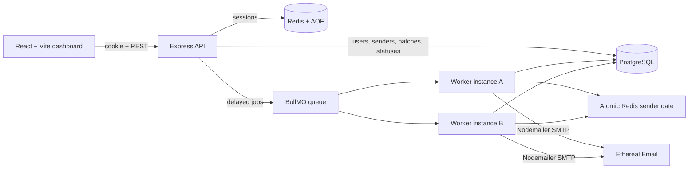

# ReachInbox Email Scheduler

A full-stack email job scheduler built for the ReachInbox/Outbox Labs internship assignment. It schedules durable BullMQ delayed jobs, sends through Ethereal SMTP, enforces atomic per-sender delivery limits, and exposes a React dashboard protected by real Google OAuth.

## Features

| Area           | Implemented                                                                   |
| -------------- | ----------------------------------------------------------------------------- |
| Authentication | Real Google OAuth 2.0, Redis sessions, protected APIs, logout                 |
| Scheduling     | BullMQ delayed jobs with deterministic job IDs; no cron                       |
| Persistence    | PostgreSQL source of truth, Redis AOF, startup reconciliation                 |
| Delivery       | Nodemailer with Ethereal SMTP and preview links                               |
| Throughput     | Configurable worker concurrency and multiple worker-instance safety           |
| Throttling     | Atomic Redis per-sender hourly quota and minimum spacing                      |
| Overflow       | Quota overflow moves to the next UTC hour without consuming SMTP retries      |
| Idempotency    | Batch idempotency keys, recipient constraints, queue deduplication, DB claims |
| Uploads        | Bounded CSV/text parsing, validation, invalid/duplicate counts, 1,000+ leads  |
| Dashboard      | Compose modal, scheduled/sent tables, polling, pagination, responsive states  |
| Verification   | Unit, integration, real-service recovery, 1,000-job load, Ethereal smoke test |

The supplied assignment contains a `Figma Link` heading but no URL. The current responsive UI follows the written requirements; pixel-level Figma reconciliation remains dependent on receiving that missing design link.

## Architecture



This is an npm-workspace monorepo:

- `apps/backend`: Express API, worker entry point, Prisma, BullMQ, Redis, SMTP and tests.
- `apps/frontend`: React, Vite, TypeScript, Tailwind and React Testing Library.
- `examples`: safe lead files for the manual demonstration.
- `docker-compose.yml`: PostgreSQL and Redis only. API, worker and frontend run locally.

PostgreSQL is authoritative for delivery status. Redis contains restart-safe execution data, sessions, and rate-limit state, but a missing Redis job can be reconstructed from a nonterminal PostgreSQL row.

## Prerequisites

- Node.js 22 or newer
- npm
- Docker Desktop with Linux containers
- A Google Cloud OAuth web client
- An Ethereal Email test account

## Local setup

From the repository root:

```bash
npm install
```

Create a local environment file. On PowerShell:

```powershell
Copy-Item .env.example .env
```

On macOS/Linux:

```bash
cp .env.example .env
```

Replace every placeholder in `.env`. Never commit this file. Then start and initialize the dependencies:

```bash
npm run infra:up
npm run db:generate
npm run db:migrate
npm run db:seed
```

Start the API, worker and frontend together:

```bash
npm run dev
```

On Windows PowerShell, use `npm.cmd` if script execution policy blocks `npm.ps1`:

```powershell
npm.cmd run dev
```

Open the exact URL configured as `FRONTEND_URL`. The API URLs are based on `BACKEND_HOST` and `BACKEND_PORT`.

Useful individual processes:

```bash
npm run dev:backend
npm run dev:worker
npm run dev:frontend
```

Stop local application processes with `Ctrl+C`. Stop containers without deleting persistent volumes with:

```bash
npm run infra:down
```

## Production deployment

Deploy the frontend to Vercel and run the stateful backend components in one Railway project:

- Vercel root directory: `apps/frontend`; build command: `npm run build`; output directory: `dist`.
- Railway API build command: `npm run build:backend`; pre-deploy command: `npm run db:migrate:deploy`; start command: `npm run start:backend`.
- Railway worker build command: `npm run build:backend`; start command: `npm run start:worker`.
- Railway also provides one PostgreSQL service and one Redis service. Both backend services reference the same private `DATABASE_URL` and `REDIS_URL`.

Set `NODE_ENV=production`, `BACKEND_HOST=0.0.0.0`, and `TRUST_PROXY=true` for the Railway API and worker. Railway supplies `PORT` dynamically to the API. Give only the API service a public domain; the worker remains private. Set `FRONTEND_URL` to the exact Vercel origin, `GOOGLE_CALLBACK_URL` to the public API callback, and `VITE_API_BASE_URL` to the public API URL ending in `/api`.

The Vite frontend includes `apps/frontend/vercel.json` so Vercel rewrites client-side routes to `index.html`, including OAuth return routes.

Keep OAuth, SMTP, and session secrets in platform environment variables. Never add them to Git, build arguments, screenshots, or deployment configuration files. Add the production frontend origin and callback URL to the Google OAuth client before testing sign-in.

## Environment configuration

All ports, URLs, limits, timeouts, credentials and secrets are read from `.env` and validated at startup.

| Group          | Variables                                                                                                                                                                          |
| -------------- | ---------------------------------------------------------------------------------------------------------------------------------------------------------------------------------- |
| Runtime        | `NODE_ENV`, `BACKEND_HOST`, `BACKEND_PORT`, `FRONTEND_URL`, `TRUST_PROXY`, `VITE_API_BASE_URL`, `VITE_DASHBOARD_REFRESH_MS`                                                        |
| PostgreSQL     | `POSTGRES_IMAGE`, `POSTGRES_HOST`, `POSTGRES_PORT`, `POSTGRES_CONTAINER_PORT`, `POSTGRES_USER`, `POSTGRES_PASSWORD`, `POSTGRES_DB`, `DATABASE_URL`                                 |
| Redis/BullMQ   | `REDIS_IMAGE`, `REDIS_HOST`, `REDIS_PORT`, `REDIS_CONTAINER_PORT`, `REDIS_PASSWORD`, `REDIS_TLS`, `REDIS_URL`, `BULLMQ_PREFIX`, `EMAIL_QUEUE_NAME`                                 |
| Google/session | `GOOGLE_CLIENT_ID`, `GOOGLE_CLIENT_SECRET`, `GOOGLE_CALLBACK_URL`, `SESSION_SECRET`, `SESSION_COOKIE_NAME`, `SESSION_REDIS_PREFIX`, `SESSION_TTL_MS`                               |
| SMTP           | `SMTP_HOST`, `SMTP_PORT`, `SMTP_SECURE`, `SMTP_USER`, `SMTP_PASSWORD`, `SMTP_DEFAULT_FROM_NAME`, `SMTP_DEFAULT_FROM_EMAIL`, `SMTP_CONNECTION_TIMEOUT_MS`, `SMTP_SOCKET_TIMEOUT_MS` |
| Worker policy  | `WORKER_CONCURRENCY`, `DEFAULT_MIN_SEND_DELAY_MS`, `MIN_SEND_DELAY_MS`, `MAX_SEND_DELAY_MS`, `DEFAULT_EMAILS_PER_HOUR`, `MAX_EMAILS_PER_HOUR`                                      |
| Retry/recovery | `SMTP_MAX_ATTEMPTS`, `SMTP_BACKOFF_MS`, `PROCESSING_LEASE_MS`, `JOB_RETENTION_COUNT`, `RECONCILIATION_BATCH_SIZE`, `RATE_LIMIT_RESERVATION_TTL_MS`                                 |
| API limits     | `MAX_UPLOAD_BYTES`, `MAX_LEADS_PER_BATCH`, `MAX_SUBJECT_LENGTH`, `MAX_BODY_LENGTH`, `MAX_SCHEDULE_HORIZON_DAYS`, `API_PAGE_SIZE`, `API_MAX_PAGE_SIZE`, `LOG_LEVEL`                 |

Important relationships are validated, including default values staying within configured bounds, page size not exceeding maximum page size, and rate-limit reservations lasting at least one hour.

Generate a strong local session secret rather than reusing an example value. Keep Google and SMTP credentials only in the untracked `.env`.

## Google OAuth setup

1. Create or select a Google Cloud project.
2. Open **Google Auth Platform** and configure **Branding**.
3. Choose the appropriate audience. For a demo project, external testing mode is sufficient.
4. Add the Google accounts that will test the app as test users when testing mode requires it.
5. Under **Clients**, create an **OAuth client ID** with application type **Web application**.
6. Add the exact `FRONTEND_URL` as an authorized JavaScript origin.
7. Add the exact `GOOGLE_CALLBACK_URL` as an authorized redirect URI.
8. Put the generated client ID and client secret in the local `.env` only.

The application requests only `openid`, `email`, and `profile`. The backend stores the Google subject, name, email and avatar URL. OAuth tokens are not returned to the frontend and are not persisted by this application.

## Ethereal SMTP setup

1. Create a test account at [Ethereal Email](https://ethereal.email/create).
2. Copy its SMTP host, port, username and password into the matching local `.env` variables.
3. Set `SMTP_DEFAULT_FROM_NAME` to the display name you want in previews.
4. Set `SMTP_DEFAULT_FROM_EMAIL` to the Ethereal account email/username.
5. Never commit those credentials.

Ethereal captures messages for preview; it does not deliver them to real recipient inboxes. Verify the configured transport with:

```bash
npm run verify:ethereal
```

The command schedules one isolated message through the real queue and worker pipeline and prints only its final status and safe preview URL.

## Database models

| Model            | Purpose and important constraints                                                                                               |
| ---------------- | ------------------------------------------------------------------------------------------------------------------------------- |
| `User`           | Google identity and profile; unique Google subject and email                                                                    |
| `EmailSender`    | Owned sender identity and active/default delivery policy; unique normalized email per user                                      |
| `EmailBatch`     | Compose request, upload counts and requested policy; unique `(userId, idempotencyKey)`                                          |
| `ScheduledEmail` | One durable recipient state; unique Bull job ID, recipient idempotency key and `(batchId, normalizedRecipientEmail)`            |
| `SendAttempt`    | Auditable claims, rate deferrals, SMTP acceptance and failure classification; unique attempt token and attempt number per email |

All backend timestamps use UTC (`timestamptz`). The browser converts them for display.

## API routes

| Method  | Route                         | Purpose                                                |
| ------- | ----------------------------- | ------------------------------------------------------ |
| `GET`   | `/api/health/live`            | Public process liveness                                |
| `GET`   | `/api/health/ready`           | Public PostgreSQL and Redis readiness                  |
| `GET`   | `/api/auth/google`            | Begin Google OAuth                                     |
| `GET`   | `/api/auth/google/callback`   | OAuth callback                                         |
| `GET`   | `/api/auth/me`                | Current authenticated user                             |
| `POST`  | `/api/auth/logout`            | Destroy the Redis-backed session                       |
| `GET`   | `/api/config/compose`         | Validated UI defaults and limits                       |
| `GET`   | `/api/senders`                | List owned senders                                     |
| `POST`  | `/api/senders`                | Create an owned sender policy                          |
| `PATCH` | `/api/senders/:senderId`      | Update an owned sender policy                          |
| `POST`  | `/api/email-batches`          | Validate multipart leads and create/schedule a batch   |
| `GET`   | `/api/email-batches/:batchId` | Batch progress and status counts                       |
| `GET`   | `/api/emails/scheduled`       | Cursor-paginated nonterminal emails                    |
| `GET`   | `/api/emails/sent`            | Cursor-paginated terminal emails and Ethereal previews |

All routes except health and OAuth entry/callback require the authenticated session. Untrusted environment, HTTP, upload, queue and SMTP boundaries are validated or safely classified.

## Queue lifecycle and restart persistence

```text
validated multipart request
  -> serializable PostgreSQL transaction
  -> EmailBatch + chunked ScheduledEmail rows
  -> deterministic BullMQ job IDs (email_<scheduledEmailId>)
  -> delayed until nextAttemptAt
  -> atomic Redis sender admission
  -> conditional PostgreSQL processing claim
  -> Nodemailer/Ethereal
  -> SENT, FAILED, RETRYABLE, RATE_LIMITED, or DELIVERY_UNKNOWN
```

On worker startup:

1. Accepted sends from the current UTC hour seed Redis counters from PostgreSQL.
2. Expired `PROCESSING` leases become `DELIVERY_UNKNOWN` rather than being sent again blindly.
3. Every nonterminal PostgreSQL row is reconciled into BullMQ in bounded chunks.
4. Existing deterministic job IDs are deduplicated by BullMQ.

PostgreSQL and Redis use Docker volumes. Redis also uses AOF. Stopping and restarting the API/worker therefore does not recreate campaigns or lose future jobs.

Run the automated recovery proof with:

```bash
npm run verify:recovery
```

## Concurrency and rate limiting

`WORKER_CONCURRENCY` controls concurrency inside each worker process. Multiple worker processes can consume the same queue safely.

Before claiming a row, every worker calls one Redis Lua script using sender-tagged keys. The script atomically checks:

- the fixed UTC hourly counter for that sender;
- the sender's next allowed send timestamp;
- a per-email reservation that makes repeated admission idempotent.

If spacing is not available, the BullMQ job is moved to the next allowed timestamp. If the hourly quota is full, it is moved directly to the next UTC hour boundary. These are delayed jobs, not failures, and do not consume SMTP retry attempts.

Different senders have independent Redis keys and can progress concurrently. The sender policy is persisted in PostgreSQL. Scheduling a batch updates that sender's active hourly limit and spacing policy to the submitted values.

## Idempotency and duplicate-send prevention

The system layers several controls:

1. The frontend creates one idempotency key per compose attempt.
2. PostgreSQL uniquely constrains `(userId, idempotencyKey)` for batches.
3. Normalized recipients are unique inside a batch.
4. Each row receives a deterministic `email_<UUID>` BullMQ job ID.
5. A conditional PostgreSQL update claims only a nonterminal, unclaimed row.
6. Redis reservations prevent one email from consuming quota twice.
7. A deterministic SMTP `Message-ID` is generated from the scheduled-email ID.
8. Terminal PostgreSQL rows make duplicate queue deliveries no-ops.

SMTP cannot provide a distributed transaction with PostgreSQL. If a process dies after the SMTP server accepted the message but before the database commit, automatic resend could duplicate the email. The implementation deliberately marks an expired ambiguous claim `DELIVERY_UNKNOWN` and requires review instead of silently resending. This favors no duplicates over automatic recovery from an uncertain external side effect.

## Behavior with 1,000+ emails

- Upload bytes and lead counts are bounded by configuration.
- Recipient rows are inserted in database chunks.
- BullMQ jobs contain only a scheduled-email ID, not duplicated message bodies.
- Jobs are added in configurable reconciliation chunks.
- Worker concurrency bounds simultaneous work.
- The Redis Lua gate prevents parallel workers from exceeding sender policy.
- Excess quota is represented as delayed jobs, not a busy retry loop.
- Cursor pagination keeps dashboard responses bounded.

The load proof uses PostgreSQL, Redis, BullMQ, two worker instances and a fake SMTP adapter. It creates 1,000 rows, removes queue jobs, reconstructs them from PostgreSQL, enqueues duplicates, and verifies exactly one SMTP acceptance per row:

```bash
npm run verify:load
```

It does not send 1,000 messages to Ethereal.

## Lead file formats

Accepted extensions are `.csv` and `.txt`.

- CSV may contain a case-insensitive `email` header.
- A CSV without that header must be a single column.
- Text files may use one address per line or comma-separated addresses.
- Addresses are trimmed and normalized for duplicate detection.
- Invalid and duplicate rows are counted and excluded.
- A request with no valid recipients is rejected.

Safe examples are available at [examples/demo-leads.csv](./examples/demo-leads.csv) and [examples/rate-limit-leads.txt](./examples/rate-limit-leads.txt).

## Testing and quality commands

Run from the repository root:

```bash
npm run typecheck
npm run lint
npm run format:check
npm test
npm run test:integration
npm run verify:recovery
npm run verify:load
npm run build
npm audit --audit-level=high
```

Integration tests require the Docker PostgreSQL and Redis services. SMTP is injected/faked in automated tests; only `verify:ethereal` uses the real configured Ethereal account.

## Troubleshooting

### Frontend starts on a different port

Stop all old development terminals with `Ctrl+C`, then run `npm run dev` once. Use the exact `FRONTEND_URL` registered in Google Cloud. A fallback Vite port is a different CORS origin and is intentionally rejected.

### `AUTHENTICATION_REQUIRED` after Google login

Use the same browser/profile for the login flow and dashboard. Confirm cookies are enabled and `FRONTEND_URL`, `VITE_API_BASE_URL`, `GOOGLE_CALLBACK_URL`, and the Google Console entries match exactly.

### `redirect_uri_mismatch`

Copy the exact `GOOGLE_CALLBACK_URL` into the OAuth client's authorized redirect URIs. Scheme, host, port and path must all match.

### Workspace unavailable

Check:

```bash
docker compose ps
```

Then visit `/api/health/live` and `/api/health/ready` on the configured backend origin. Restart with `npm run infra:up` and `npm run dev` if necessary.

### Prisma cannot find `DATABASE_URL`

Run the documented root npm scripts. They explicitly load the root `.env`; do not create additional credential files under `apps/backend`.

### Email remains rate limited

This is expected when the sender's UTC-hour quota is exhausted. The scheduled table shows the next attempt time. For a quick demo, choose a sensible test policy before scheduling; do not alter Redis counters manually.

### Ethereal send fails

Confirm the Ethereal SMTP account is current and that host, port, secure mode, username and password match its credentials page. Run `npm run verify:ethereal` before the recording.

## Five-minute demonstration

Prepare Docker, `.env`, Google test-user access and Ethereal before recording. Keep `examples/demo-leads.csv` ready.

1. **0:00–0:35 — Start and authenticate**
   Show `docker compose ps`, run `npm run dev`, open the configured frontend URL, and complete real Google login. Point out the authenticated name/email/avatar fallback.

2. **0:35–1:25 — Compose**
   Click **Compose new email**, enter subject/body, upload `examples/demo-leads.csv`, show detected/valid counts, select a future start time, and choose visible delay/hourly values.

3. **1:25–2:15 — Scheduled to sent**
   Schedule once. Show rows under **Scheduled emails**, wait for polling, switch to **Sent emails**, and open one Ethereal preview.

4. **2:15–3:15 — Restart persistence**
   Schedule another batch far enough in the future. Stop application processes with `Ctrl+C` while leaving Docker running, restart with `npm run dev`, and show that the same rows remain and send at their original time.

5. **3:15–4:10 — Rate-limit behavior**
   Upload `examples/rate-limit-leads.txt` with a deliberately small hourly limit. Show admitted rows and overflow rows remaining scheduled/rate-limited for their next available time. Mention the atomic Redis Lua gate and multiple-worker safety.

6. **4:10–5:00 — Proof and architecture**
   Show the latest successful `npm run verify:load`/test output. Summarize PostgreSQL as source of truth, deterministic BullMQ IDs, startup reconciliation, configurable concurrency, and the deliberate `DELIVERY_UNKNOWN` SMTP crash trade-off.

The automated load test proves 1,000-job behavior without flooding Ethereal. Rehearse once and avoid waiting for a real next-hour rate-limit window during the video.

## Assumptions and trade-offs

- Ethereal is a test transport and not a production provider.
- Hourly limits use fixed UTC clock-hour windows, not a rolling 60-minute window.
- Sender policy is shared by that sender; the newest scheduled policy becomes active for its batches.
- Queue retention is bounded because PostgreSQL, not BullMQ history, is authoritative.
- Ambiguous SMTP outcomes are not automatically retried.
- The missing Figma URL prevents objective pixel-perfect comparison.
- Horizontal workers share PostgreSQL/Redis and the same queue/prefix configuration.

